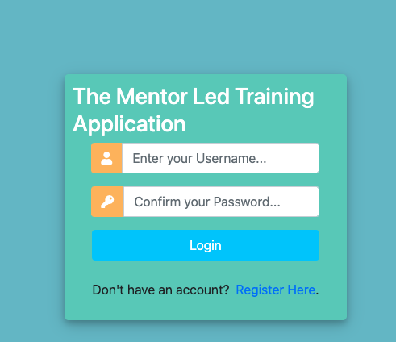
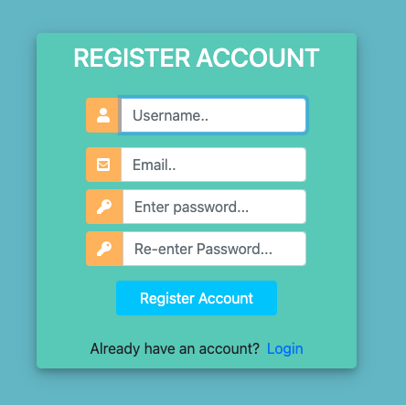
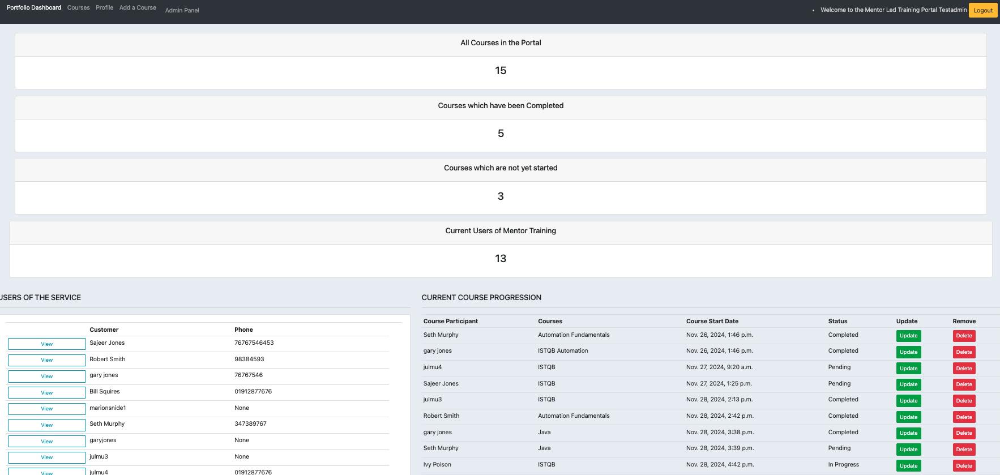

Mentor Apprentice Services

This is a Django-based web application designed to streamline mentorship training programs.
The project includes role-based access control for admins, and customers of the service, 
including features like user managements, course management and custom dashboards

Features
- Role-Based Acccess: Admins manage all users, Courses, Creation and Deletion of courses.
  They cannot access the customer profile page.
  Customers can view courses and amend their user profile page.

- Authentication: Djangos built-in user management with CSRF protection and input validation

- Deployment: Hosted on Render with SQLite database

- Testing: Fully integrated with pytest for automated testing

Screenshots of key features

Running the Application

Running the applocation from Render
https://mentorservicesapplication-3.onrender.com 
Login as an Admin for testing purposes 
- Username = julmu
- Password = peaches
# note the password was created as a superuser, since the aplication has developed
# passwords created must conform with the rules for example not common passwords and must be more complex or will give an error

Locally 
Currently the latest changes are deployed on the Develop branch 

1. Clone the develop branch from the repository on GitHub 
    git clone https://github.com/julmu1/MentorServicesApplication.git
    cd mentor_apprentice_services

2. Set Up a virtual Environment 

   python -m venv venv
   source venv/bin/activate 
   #On Windows: venv\Scripts\activate

3. Install Dependencies

   pip install -r requirements.txt

4. Run the Application
   The application is available at http://127.0.0.1:8000/.

To create a customer user 
- from the login url select the Register Here link and create a user
- login with the Username and Password created  

Testing

1. pytest

2. Generate a coverage report 
   Install the coverage plugin (if not already configured)
   pip install pytest-cov

   Run the test with coverage 
   pytest --cov mentorapp --cov-report=html

Render Deployment Notes

- Render uses SQLite for the database.
  The SQLite file (db.sqlite3) should be included in the project
  repository to persists data across deployments.
- Ensure all static files are collected during the deployment process
  using the collectstatic command 

GitHub Actions CI/CD
Workflow
The project uses GitHub Actions for continuous integration and deployment

1. Branching strategy
- The development branch is used for development
- On push to develop Branch the commit triggers the workflow 
  to run the tests and deploy to render

2. Workflow overview
- on every push the workflow:
 - install dependencies from the requirements.txt file
 - runs pytest to ensure all tests pass
 - deploys the application to Render if the push is on the develop branch

Static Files handling

1. Local Development
Django serves static files using the STATICFILES_DIRS setting

2. Production Deployment
Run the following command to collect static files into the STATIC_ROOT directory

python manage.py collectstatic